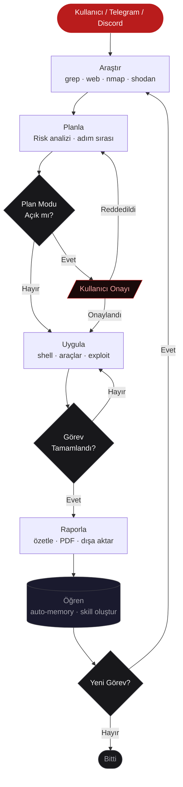

```
 ███████╗███████╗████████╗██╗██╗  ██╗
 ██╔════╝██╔════╝╚══██╔══╝██║██║  ██║
 █████╗  █████╗     ██║   ██║███████║
 ██╔══╝  ██╔══╝     ██║   ██║██╔══██║
 ██║     ███████╗   ██║   ██║██║  ██║
 ╚═╝     ╚══════╝   ╚═╝   ╚═╝╚═╝  ╚═╝
```

<p align="center">
  <strong>CTF · Pentest · OSINT · Red Team — terminalde çalışan otonom yapay zeka ajanı</strong><br/>
  Python · 20+ AI sağlayıcı · 912+ skill · Gateway · MCP · Docker · Kalıcı bellek
</p>

<p align="center">
  
  
  
  
  
</p>

<p align="center">
  <a href="#-kurulum">Kurulum</a> ·
  <a href="#-ctf--pentest-kullanımı">CTF & Pentest</a> ·
  <a href="#-ai-sağlayıcıları">AI Sağlayıcıları</a> ·
  <a href="#-skill-sistemi">Skill Sistemi</a> ·
  <a href="#-gateway">Gateway</a>
</p>

---

## FETIH Nedir?

FETIH, terminalde çalışan Türkçe/İngilizce destekli bir yapay zeka ajanıdır. Kod yazar, test çalıştırır, CTF challenge'ları çözer, pentest akışları yürütür ve raporlar üretir. İstediğin 20'den fazla AI sağlayıcısına bağlanır — ne pahalı bir API'ye kilitlisin, ne de tek bir modele.

Temel fark: FETIH **öğrenir ve kendini geliştirir**. Karmaşık görevleri tamamlayınca otomatik skill oluşturur, bu skill'leri sonraki kullanımda iyileştirir, konuşmalarında önemli bilgileri hatırlar. Telegram'dan mesaj at, cloud VM'de çalışsın — dizüstüne bağlı kalmana gerek yok.

**Temel döngü:** `Araştır → Planla → Uygula → Raporla → Öğren`



---

## Neden FETIH?

| | **FETIH** | ChatGPT | Claude Code | Cursor | diğer CLI |
|---|---|---|---|---|---|
| AI Sağlayıcı sayısı | **20+** | 1 | 1 | çoklu | 1–5 |
| Terminal / CLI | ✓ | ✓ | ✓ | kısmi | ✓ |
| Gerçek shell erişimi | ✓ | kısmi | ✓ | kısmi | bazıları |
| CTF araç seti | **✓ (MCP köprüsü)** | ✗ | ✗ | ✗ | ✗ |
| Pentest araç entegrasyonu | ✓ | ✗ | ✗ | ✗ | ✗ |
| Telegram / Discord gateway | ✓ | ✗ | ✗ | ✗ | ✗ |
| 912+ skill kataloğu | ✓ | ✗ | ✗ | ✗ | ✗ |
| Kalıcı bellek + öğrenme | ✓ | kısmi | kısmi | ✗ | bazıları |
| Multi-agent (paralel) | ✓ | ✗ | kısmi | kısmi | bazıları |
| Offline / yerel model | ✓ | ✗ | ✗ | ✗ | bazıları |
| Docker ile çalıştırma | ✓ | ✗ | ✗ | ✗ | ✗ |
| Açık kaynak | ✓ | ✗ | ✗ | ✗ | çeşitli |

---

## CTF & Pentest Kullanımı

FETIH'i CTF ve penetrasyon testlerinde kullanmak için özel bir kurulum gerekmez — sadece ilgili profili etkinleştir ve hedefe yönelt.

### Hızlı Başlangıç: CTF

```bash
# 1. FETIH'i başlat (herhangi bir AI sağlayıcısıyla)
fetih --model claude-sonnet-4-6        # Kod analizi için önerilir
fetih --model gpt-4o                   # Vision gerektiren challenge'lar için
fetih --model gemini-2.5-pro           # 2M token bağlamla devasa dump dosyaları için
fetih --model deepseek/deepseek-r1     # Ücretsiz, thinking modeli — crypto matematiği için

# 2. CTF profilini etkinleştir
fetih config set profile ctf

# 3. Challenge klasörüne gir
cd /home/ctf/challenge-2025/

# 4. FETIH'e ver
fetih -p "bu klasördeki tüm challenge'ları çöz, flag'leri flags.txt'e yaz"
```

### Hızlı Başlangıç: Pentest

```bash
# Pentest profili — nmap, sqlmap, nuclei, ffuf, gobuster, hydra hepsini tanır
fetih config set profile pentest

# Hedef tara (SADECE YETKİLİ SİSTEMLERDE)
fetih -p "hedef.local adresini tara: subdomain, port, web zafiyet, SSL sertifika"

# Ya da interaktif modda
fetih
> /tools pentest          # Pentest araç setini etkinleştir
> "hedef.local'in giriş sayfasını SQLi ve XSS açısından analiz et"
```

---

### CTF Kategorileri ve Yaklaşımlar

FETIH'e herhangi bir challenge dosyası veya metni verdiğinde hangi araçları kullanacağını, hangi sırada deneyeceğini ve başarısız olursa nasıl geri döneceğini kendisi belirler. Aşağıdaki kategorilerde nasıl davrandığını görebilirsin:

#### Kriptografi

```
# Classic encoding:
sen: "bu string'i çöz: aGVsbG8gd29ybGQ="
FETIH: Base64 decode → "hello world"

# Çok katmanlı:
sen: "enc.txt → recursive decode et"
FETIH: Hex → Base64 → ROT13 → Caesar(13) → XOR(0x41) → flag{}

# RSA (n, e, c verildiğinde):
sen: "n=..., e=65537, c=... — RSA çöz"
FETIH: factordb lookup → Fermat factorization → Wiener attack → flag

# Modern:
sen: "Bu AES-CBC ciphertext'te padding oracle açığı var mı?"
FETIH: Padding oracle Python template üretir → saldırı kodu çalıştırır
```

#### Steganografi

```
# PNG:
sen: "challenge.png'de gizlenmiş flag var"
FETIH: LSB analiz (R/G/B/A kanalları) → alpha channel → görsel fark → flag

# Ses:
sen: "audio.wav'i incele"
FETIH: DTMF tone decode → WAV LSB → Morse analiz → spektogram (vision ile) → flag

# Görüntü analizi (VLM):
sen: "bu fotoğraftaki yazıyı oku"
FETIH: Bağlı AI modelinin vision kapasitesini kullanır → OCR + QR fallback
```

#### Binary / Reverse Engineering

```
# Statik analiz:
sen: "./binary'yi analiz et"
FETIH: file + strings + objdump + readelf → NX/PIE/canary tespiti → zafiyet

# Buffer overflow:
sen: "buffer overflow var, exploit yaz"
FETIH: cyclic pattern → offset hesapla → ROP gadget ara → shellcode üret → exploit

# Remote:
sen: "challenge.tld:1337'ye bağlan"
FETIH: pwntools remote() wrapper → socket → exploit zinciri çalıştırır
```

#### Web

```
sen: "login.php'yi test et"
FETIH: SQLi (error-based, blind) → XSS → LFI → IDOR → dizin keşfi → payload önerileri

sen: "JWT token'ı kır: eyJ..."
FETIH: Decode → alg:none saldırı → HMAC brute-force → claim forge → admin token
```

#### Forensics / OSINT

```
# Dosya analizi:
sen: "memory.dmp'den flag çıkar"
FETIH: strings sweep → volatility/volatility3 → cmdline geçmişi → flag

sen: "bu PCAP'te ne var?"
FETIH: Binary parser → HTTP/FTP/DNS stream → cleartext credential → flag

# OSINT:
sen: "hedef.com hakkında OSINT topla"
FETIH: whois → DNS TXT/MX/NS → Shodan → cert.sh → LinkedIn/GitHub → rapor
```

---

### Senaryo: Tek Komutla 6 Challenge

```bash
fetih --auto -p "
/home/ctf/final/ klasöründeki 6 challenge'ı sırayla çöz.
Her birini analiz et, flag formatı flag{...} olan string'i bul,
sonuçları ./flags.txt dosyasına yaz ve hangi araçları kullandığını açıkla.
"
```

FETIH ne yapar:
```
[chal1.png]  → LSB R kanalı → flag{lsb_hidden_r}
[audio.wav]  → DTMF Goertzel decode → 0258# → flag{dtmf_0258}
[token.jwt]  → HMAC brute → "secret" → admin forge → flag{admin_jwt}
[pwn1]       → checksec → cyclic → offset=72 → shellcode → flag{ret2win}
[enc.txt]    → 3 katman: Hex→Base64→ROT47 → flag{multi_encoded}
[photo.jpg]  → derin EXIF → COM marker → flag{hidden_in_metadata}
```

---

### Senaryo: Paralel Sınav Modu

Büyük CTF'lerde her kategori için ayrı terminal açıp hepsini aynı anda çalıştır:

```bash
# Terminal 1 — Crypto
cd /ctf/crypto && fetih --auto -p "tüm challenge'ları çöz, flag'leri kaydet"

# Terminal 2 — Web
cd /ctf/web && fetih --auto -p "her URL'yi ctf_web_analyzer ile tara"

# Terminal 3 — PWN
cd /ctf/pwn && fetih --auto -p "binary'leri analiz et, exploitlari yaz"

# Terminal 4 — Forensics
cd /ctf/forensics && fetih --auto -p ".pcap, .dmp, .raw dosyalarını incele"
```

Her terminal bağımsız, AI modeli farklı olabilir. Crypto için ucuz düşünen model, PWN için kod odaklı model.

---

### Senaryo: Pentest Raporu

```bash
fetih

> /tools pentest
> "hedef.com alan adını kapsamlı tara:
>  - Subdomain keşfi
>  - Açık portlar ve servisler
>  - Web uygulaması zafiyetleri
>  - SSL/TLS konfigürasyon sorunları
>  - Bulunanları önem sırasına göre raporla"

# FETIH sırayla yapar:
#  subfinder/amass → subdomain listesi
#  nmap SYN scan → port/servis/versiyon
#  nuclei → template bazlı zafiyet tarama
#  nikto → web başlık analizi
#  testssl.sh → SSL sorunları
#  Tüm bulguları birleştirir, CVSS skorlar, markdown rapor üretir

> /export pdf    # PDF raporu oluştur
```

---

## AI Sağlayıcıları

FETIH 20'den fazla AI sağlayıcısına bağlanır. Hepsini `fetih model` komutuyla değiştirebilir, bir sonraki oturumda farklı sağlayıcı kullanabilirsin. Kod değişikliği yok, lock-in yok.

### Bağlanma

```bash
# Başlatırken sağlayıcı belirt:
fetih --model claude-sonnet-4-6
fetih --model gpt-4o
fetih --model gemini/gemini-2.5-pro
fetih --model openrouter/deepseek/deepseek-r1
fetih --model ollama/qwen2.5-coder:32b          # Yerel, ücretsiz, offline

# Çalışırken değiştir:
fetih model

# API anahtarı ayarla:
fetih config set api_key ANTHROPIC_API_KEY sk-ant-...
```

### Sağlayıcı Tablosu

| Sağlayıcı | Env Değişkeni | Özellik | CTF/Pentest için |
|-----------|---------------|---------|-----------------|
| **Anthropic (Claude)** | `ANTHROPIC_API_KEY` | Güçlü kod analizi, vision | ✓ Kod/RE/exploit |
| **OpenAI (GPT-4o)** | `OPENAI_API_KEY` | Güçlü vision, genel | ✓ Stego/görsel |
| **Google Gemini** | `GEMINI_API_KEY` | 2M token bağlam | ✓ Büyük dump dosyaları |
| **Groq** | `GROQ_API_KEY` | En hızlı çıkarım (~900 tok/s) | ✓ Hızlı iterasyon |
| **DeepSeek** | `DEEPSEEK_API_KEY` | Thinking mode, ucuz | ✓ Crypto/matematik |
| **OpenRouter** | `OPENROUTER_API_KEY` | 200+ model tek API | ✓ Farklı model dene |
| **Mistral** | `MISTRAL_API_KEY` | Avrupa gizliliği | ✓ Veri gizliliği önemse |
| **xAI (Grok)** | `XAI_API_KEY` | Gerçek zamanlı web | ✓ OSINT/web lookup |
| **Cohere** | `COHERE_API_KEY` | RAG odaklı | — |
| **Together AI** | `TOGETHER_API_KEY` | Açık ağırlıklı modeller | ✓ Llama/Mistral |
| **Fireworks** | `FIREWORKS_API_KEY` | Hızlı inference | ✓ Hız gerektiğinde |
| **Perplexity** | `PERPLEXITY_API_KEY` | Web aramalı yanıt | ✓ OSINT |
| **Ollama** | — (yerel) | Ücretsiz, offline, gizli | ✓ Hassas hedefler |
| **LM Studio** | — (yerel) | GUI ile yerel model | ✓ Air-gap ortam |
| **Azure OpenAI** | `AZURE_OPENAI_API_KEY` | Kurumsal | ✓ Kurum pentesti |
| **Vertex AI** | `GOOGLE_APPLICATION_CREDENTIALS` | GCP | ✓ |
| **AWS Bedrock** | AWS credentials | AWS | ✓ |
| **NVIDIA NIM** | `NVIDIA_API_KEY` | Nemotron | ✓ |
| **HuggingFace** | `HF_TOKEN` | Açık model hub | ✓ |
| **Kimi/Moonshot** | `MOONSHOT_API_KEY` | Uzun bağlam | ✓ |

**CTF önerisi:** Ücretsiz başlamak için Ollama (yerel) + `qwen2.5-coder:32b` model, ağır analiz için `claude-sonnet-4-6` veya `gemini-2.5-pro`.

**Pentest önerisi:** `deepseek-r1` (ucuz + düşünen) günlük kullanım, raporlama için `claude-sonnet-4-6`.

```bash
# Ücretsiz yerel model kurulumu (Ollama):
curl -fsSL https://ollama.com/install.sh | sh
ollama pull qwen2.5-coder:32b          # 20GB — güçlü kod modeli
ollama pull llama3.3:70b               # 43GB — genel güçlü model

fetih --model ollama/qwen2.5-coder:32b
```

---

## CTF / Pentest Araç Deposu

FETIH, **83 araç** ve **9 kategori** ile kurulu gelir. İlk kurulumda otomatik sorar; sonradan tek komutla indirilir:

```bash
fetih download-tools            # interaktif menü
fetih download-tools all        # hepsini kur
fetih download-tools basic      # temel set (nmap, sqlmap, pwntools, gdb, binwalk...)
fetih download-tools status     # hangisi kurulu göster
fetih download-tools network    # sadece ağ araçları
fetih download-tools web        # sadece web araçları
fetih download-tools binary     # binary/exploit
fetih download-tools forensics  # disk forensics
fetih download-tools stego      # steganografi
fetih download-tools crypto     # kriptografi kütüphaneleri
fetih download-tools mobile     # Android/mobil
fetih download-tools osint      # OSINT
```

### Araç Kataloğu (83 araç)

| Kategori | Araçlar | Yöntem |
|----------|---------|--------|
| **Ağ Keşif** (15) | nmap, masscan, arp-scan, dnsenum, fierce, rustscan, tshark, wireshark, scapy, pyshark, subfinder, amass, waybackurls, gau, assetfinder | apt/pip/go/cargo |
| **Web Saldırı** (16) | sqlmap, nikto, nuclei, dalfox, ffuf, gobuster, feroxbuster, arjun, wafw00f, wpscan, katana, hakrawler, smuggler, httpx, aiohttp, racepwn | apt/pip/go/gem |
| **Sızma Testi** (6) | hydra, john, hashcat, netexec, haiti-hash, metasploit | apt/pip/script |
| **Binary/Exploit** (11) | gdb, pwntools, radare2, ropper, checksec, one_gadget, angr, z3-solver, seccomp-tools, pwndbg, ghidra | apt/pip/gem/git/deb |
| **Kriptografi** (5) | pycryptodome, gmpy2, sympy, fpylll, padding-oracle | pip |
| **Disk Forensics** (15) | binwalk, foremost, testdisk, sleuthkit, autopsy, exiftool, ewf-tools, ntfs-3g, volatility3, pypykatz, analyzeMFT, pytsk3, bless, wxhexeditor, wrk | apt/pip |
| **Steganografi** (9) | steghide, zsteg, stegoveritas, stegseek, stegolsb, ffmpeg, sox, audacity, sonic-visualiser | apt/pip/gem/deb |
| **Mobil** (4) | androguard, frida-tools, objection, ntfs-tools | pip |
| **OSINT** (2) | maigret, sherlock | pip |

---

## Kurulum

### Linux / macOS / WSL2

```bash
curl -fsSL https://raw.githubusercontent.com/MustafaKemal0146/fetih/main/scripts/install.sh | bash
source ~/.bashrc   # veya source ~/.zshrc
fetih              # başlat
```

### Windows (PowerShell)

```powershell
irm https://raw.githubusercontent.com/MustafaKemal0146/fetih/main/scripts/install.ps1 | iex
```

#### Windows — Manuel / Geliştirici Kurulumu

Eğer yukarıdaki tek satırlık installer çalışmazsa ya da geliştirme modunda kurmak istiyorsan:

```powershell
# 1. Repoyu klonla
git clone https://github.com/MustafaKemal0146/fetih.git
cd fetih\fetih

# 2. Bağımlılıkları kur (computer-use dahil)
py -m pip install -e .[computer-use]

# 3. Komutu test et
fetih --version
```

`fetih` komutu tanınmıyorsa Scripts klasörü PATH'te olmayabilir:

```powershell
# Scripts klasörünün tam yolunu öğren
py -c "import sysconfig; print(sysconfig.get_path('scripts'))"

# Örnek çıktı: C:\Users\kullanici\AppData\Local\Programs\Python\Python313\Scripts
# Bu yolu kalıcı olarak PATH'e ekle:
$scriptsPath = py -c "import sysconfig; print(sysconfig.get_path('scripts'))"
[Environment]::SetEnvironmentVariable("PATH", "$env:PATH;$scriptsPath", "User")

# Terminali kapat/aç, sonra test et:
fetih --version
```

#### Windows — Computer-Use (Masaüstü Kontrol)

Computer-use özelliği `pip install -e .[computer-use]` ile otomatik kurulur.
Kurulum doğrulaması:

```powershell
# Bağımlılıkları kontrol et
py -c "import pyautogui, PIL; print('pyautogui:', pyautogui.__version__); print('pillow OK')"

# FETIH içinde computer-use'u etkinleştir:
fetih
> /computer-use on
```

Etkinleştirildiğinde TUI durum çubuğu kırmızıya döner. Fareyi ekranın sol üst köşesine (0, 0) götürünce kontrol durur (FAILSAFE).

### Docker

```bash
docker run -it --rm \
  -e ANTHROPIC_API_KEY=sk-ant-... \
  -v "$HOME/.fetih:/opt/data" \
  ghcr.io/mustafakemal0146/fetih

# Tam araç seti için (nmap, sqlmap, nuclei vb. dahil):
docker run -it --rm \
  -e ANTHROPIC_API_KEY=sk-ant-... \
  -e OPENAI_API_KEY=sk-... \
  -v "$HOME/.fetih:/opt/data" \
  --network host \
  ghcr.io/mustafakemal0146/fetih
```

### Geliştirici Kurulumu (uv)

```bash
git clone https://github.com/MustafaKemal0146/fetih.git
cd fetih
uv sync --extra all
source .venv/bin/activate   # Windows: .venv\Scripts\activate
fetih --version

# Computer-use özelliğiyle:
uv sync --extra all --extra computer-use
fetih
# > /computer-use on
```

### Termux (Android)

```bash
pkg install python nodejs-lts ripgrep
pip install fetih-agent[termux-all]
fetih
```

---

## Skill Sistemi

FETIH'in en güçlü özelliklerinden biri **skill** sistemidir. Bir skill, tekrar eden görevleri tek komutla çalıştırmanı sağlayan yapılandırılmış bir iş akışıdır. FETIH kataloğunda **912+** hazır skill bulunur; kendi skill'lerini de yazabilirsin.

> **Yeni:** [ljagiello/ctf-skills](https://github.com/ljagiello/ctf-skills) (107 referans dosya) ve [Eyadkelleh/awesome-claude-skills-security](https://github.com/Eyadkelleh/awesome-claude-skills-security) (SecLists + LLM testing + agent/command seti) entegre edildi.

### Skill Kullanımı

```bash
# Yüklü skill'leri listele
fetih skills

# Skill çalıştır
fetih /skill pentest-web hedef.com
fetih /skill ctf-crypto enc.txt
fetih /skill osint-domain hedef.com
fetih /skill code-review src/

# İnteraktif modda
fetih
> /pentest-web hedef.com
> /osint-domain mustafa.com
```

### Hazır Skill Örnekleri (CTF & Güvenlik)

| Skill | Ne Yapar? |
|-------|-----------|
| `pentest-web` | Tam web application pentest: SQLi, XSS, LFI, IDOR, auth bypass |
| `pentest-network` | Ağ tarama + servis tespiti + zafiyet analizi |
| `ctf-crypto` | Dosya/metin verildiğinde encoding katmanlarını çözer |
| `ctf-forensics` | PCAP, dump, image dosyalarından flag çıkarır |
| `osint-domain` | Alan adı OSINT: whois, DNS, cert, subdomain, wayback |
| `osint-person` | Kişi araştırması: sosyal medya, e-posta, ihlal veritabanları |
| `bug-bounty` | Web uygulaması kapsamlı bug bounty tarama akışı |
| `code-audit` | Güvenlik açısından kaynak kod denetimi |
| `malware-analysis` | Statik ve dinamik zararlı yazılım analizi |
| `report-generate` | Tüm bulguları profesyonel pentest raporu haline getirir |

### Kendi Skill'ini Yaz

`~/.fetih/skills/ctf-pwn-auto/SKILL.md` oluştur:

```markdown
---
name: ctf-pwn-auto
description: Binary dosyası verildiğinde checksec + exploit zinciri otomatik çalıştır
tools: [bash, file_read]
---

Verilen binary dosyasını analiz et: {{params}}

Adımlar:
1. checksec ile güvenlik bayraklarını kontrol et (NX, PIE, canary, RELRO)
2. strings ile ilginç string'leri bul
3. objdump/readelf ile fonksiyon listesi çıkar
4. Buffer overflow varsa cyclic pattern ile offset hesapla
5. İşe yarar exploit zinciri oluştur (ret2win, ret2libc, ROP)
6. Exploit'i yaz ve çalıştır
```

```bash
fetih /skill ctf-pwn-auto ./pwn_challenge
```

---

## Gateway

FETIH, yalnızca terminal uygulaması değil — **gateway** modu ile Telegram, Discord ve diğer platformlardan da kullanılabilir. Bir kez çalıştır, her yerden eriş.

```bash
# Gateway kurulumu
fetih gateway setup       # Tüm platformları tek sihirbazla yapılandır
fetih gateway start       # Arka planda başlat
fetih gateway status      # Aktif bağlantıları göster
```

### Desteklenen Platformlar

| Platform | Durum | Nasıl Kullanılır? |
|----------|-------|-------------------|
| **Telegram** | Stabil | Botu başlat, `TELEGRAM_BOT_TOKEN` ekle |
| **Discord** | Stabil | Bot daveti, `DISCORD_BOT_TOKEN` ekle |
| **Slack** | Stabil | Workspace kurulumu, `SLACK_BOT_TOKEN` ekle |
| **WhatsApp** | Beta | Baileys bridge, QR kodu tara |
| **Signal** | Beta | signal-cli ile |
| **Matrix** | Beta | Matrix homeserver bağlantısı |
| **API (REST)** | Stabil | HTTP endpoint — kendi integrasyon yazabilirsin |

### Telegram ile CTF

```
# Telefon:
sen → Telegram bot: "pwn1 binary'sini analiz et"
FETIH → checksec çalıştırır, offset hesaplar, exploit yazar
FETIH → Telegram: "flag{buffer_overflow_pwned} — offset: 72, ret2win: 0x401196"

# Uzak VM'deyken laptop kapatılabilir — FETIH çalışmaya devam eder
```

```bash
# Telegram bot kurulumu
export TELEGRAM_BOT_TOKEN=1234567890:ABC...
fetih gateway start --platform telegram
```

---

## Özellikler

### Kalıcı Bellek

FETIH iki katmanlı bellek sistemi kullanır:

**Otomatik Bellek** — Konuşma sonunda AI önemli bilgileri otomatik kaydeder:
```
FETIH: "Bu hedefe daha önce baktım — subdomain listesi var,
        önceki taramada port 8080'de Jenkins 2.3 bulunmuştu (CVE-2024-...)"
```

**Manuel Bellek:**
```bash
fetih memory add user    "Kali Linux 2025.1, ağ: 10.10.10.0/24"
fetih memory add project "Bu proje OWASP Top 10 odaklı — auth bypass öncelik"
fetih memory add feedback "Raporları Türkçe yaz"
```

### Multi-Agent (Paralel)

Büyük görevleri birden fazla alt ajana böler:

```bash
> "hedef.com'u tara: subdomain, port, web zafiyet — hepsini paralel çalıştır"

# FETIH yapar:
#  [Ajan 1] subfinder → 47 subdomain
#  [Ajan 2] nmap SYN → 12 açık port
#  [Ajan 3] nuclei → 2 kritik CVE
#  Koordinatör birleştirir → tek rapor
```

### Hooks & Otomasyon

`~/.fetih/hooks.json`:
```json
[
  { "event": "PostToolUse", "tool": "bash",
    "command": "notify-send 'FETIH tamamladı'", "async": true },
  { "event": "OnResponse",
    "command": "echo '[FETIH]' >> ~/pentest.log" }
]
```

### Cron (Zamanlanmış Görev)

```bash
# Her sabah CVE feed kontrolü
fetih cron add cve-watch "0 8 * * *" "dün yayımlanan kritik CVE'leri kontrol et, ilgili olanları raporla"

# Haftalık otomatik tarama
fetih cron add weekly-scan "0 9 * * 1" "hedef.local haftalık ağ taraması — değişiklikleri raporla"
```

### Vision (Görsel Analiz)

```bash
# Captcha çöz:
sen: "captcha.png'deki kodu oku"
FETIH: Bağlı modelin vision kapasitesini kullanır → "X9K7AP"

# Stego:
sen: "bu görsel içinde gizlenmiş bir şey var mı?"
FETIH: Görsel analizi + LSB kontrol + metadata tarama

# Ekran görüntüsü:
sen: "screenshot.png'deki kod güvenli mi?"
FETIH: OCR → kod çıkarır → güvenlik analizi yapar
```

---

## Komutlar

### CLI Komutları

```bash
fetih                          # İnteraktif mod
fetih -p "görev açıkla"       # Tek seferlik (headless)
fetih --auto -p "görev"       # Onaysız otonom mod
fetih model                    # AI modeli/sağlayıcı değiştir
fetih tools                    # Araç yapılandırması
fetih config                   # Ayarlar
fetih gateway                  # Gateway yönetimi
fetih skills                   # Skill kataloğu
fetih memory                   # Bellek yönetimi
fetih cron                     # Zamanlanmış görevler
fetih doctor                   # Ortam sağlık kontrolü
fetih update                   # Sürüm güncelle
```

### İnteraktif Mod Komutları

| Komut | Açıklama |
|-------|----------|
| `/help` | Tüm komutları listele |
| `/model` | AI modeli değiştir |
| `/tools` | Araç profilini değiştir (`ctf`, `pentest`, `code`, `all`) |
| `/memory` | Kalıcı belleği görüntüle |
| `/skills` | Skill listesi |
| `/<skill-adı>` | Skill çalıştır |
| `/checkpoint` | Konuşma anını kaydet |
| `/compress` | Geçmişi özetle (token tasarrufu) |
| `/export [md\|json\|pdf]` | Konuşmayı dışa aktar |
| `/status` | Aktif görevler, token kullanımı |
| `Ctrl+C` | İşlemi iptal et |
| `Esc` | AI yanıtını durdur |

---

## Yapılandırma

### Ortam Değişkenleri

```bash
# ~/.bashrc veya ~/.zshrc içine ekle:

export ANTHROPIC_API_KEY=sk-ant-...
export OPENAI_API_KEY=sk-...
export GEMINI_API_KEY=AIza...
export GROQ_API_KEY=gsk_...
export DEEPSEEK_API_KEY=sk-...
export OPENROUTER_API_KEY=sk-or-...
export XAI_API_KEY=xai-...
export MISTRAL_API_KEY=...

# Gateway:
export TELEGRAM_BOT_TOKEN=...
export DISCORD_BOT_TOKEN=...
export SLACK_BOT_TOKEN=...
```

### Proje Talimatları

Çalışma dizininde `FETIH.md` veya `CLAUDE.md` dosyası varsa otomatik yüklenir:

```markdown
# FETIH.md
Bu bir pentest projesidir. Hedef: 10.10.10.0/24 ağı.
- Raporları Türkçe yaz
- Flag formatı: THM{...} veya HTB{...}
- Her adımı açıkla — öğrenme amaçlı
```

---

## Mimari

```
fetih/
├── fetih_cli/
│   ├── main.py               # CLI giriş noktası (fetih komutu)
│   ├── commands.py           # Slash komutları
│   ├── config.py             # Yapılandırma yönetimi
│   ├── auth.py               # API anahtar yönetimi
│   └── tui_dist/             # Terminal UI (ink/React)
├── agent/
│   ├── loop.py               # Ajan döngüsü
│   ├── prompt_builder.py     # Sistem prompt oluşturma
│   └── coordinator.py        # Multi-agent koordinatör
├── tools/
│   ├── bash_tool.py          # Shell erişimi
│   ├── browser_tool.py       # Web otomasyon (Playwright)
│   ├── file_tools.py         # Dosya okuma/yazma/düzenleme
│   ├── web_tools.py          # Web fetch / arama
│   ├── vision_tool.py        # Görsel analiz (VLM)
│   └── ctf/                  # CTF araç köprüsü (MCP)
│       ├── crypto_tools.py   # RSA, AES, hash, JWT, encoding
│       ├── stego_tools.py    # PNG/WAV LSB, DTMF, spektogram
│       ├── pwn_tools.py      # Cyclic, checksec, shellcode, ROP
│       ├── forensics_tools.py# PCAP, memory dump, file carving
│       └── web_tools.py      # SQLi, XSS, LFI, IDOR
├── gateway/
│   ├── telegram/             # Telegram bot
│   ├── discord/              # Discord bot
│   ├── slack/                # Slack app
│   └── whatsapp/             # WhatsApp bridge
├── skills/
│   ├── security/             # Pentest, bug bounty, code audit
│   ├── ctf/                  # CTF kategorileri
│   ├── osint/                # OSINT iş akışları
│   └── ...                   # 912+ skill
└── plugins/                  # Eklenti sistemi
```

---

## Gereksinimler

- **Python** 3.11+
- **Node.js** 18+ (TUI için)
- **uv** (paket yöneticisi — installer otomatik kurar)
- En az bir AI sağlayıcısı (Ollama ile ücretsiz başlanabilir)
- **Önerilen:** `ripgrep`, `git`
- **CTF için:** `nmap`, `sqlmap`, `nuclei`, `ffuf`, `john`, `hashcat`, `binwalk`, `pwntools`
- **Pentest için:** `nmap`, `sqlmap`, `nikto`, `nuclei`, `subfinder`, `gobuster`, `metasploit`

```bash
# Kali Linux'ta tüm güvenlik araçları zaten mevcut
# Ubuntu/Debian için hızlı kurulum:
sudo apt install nmap sqlmap nikto binwalk foremost ffmpeg tesseract-ocr
pip install pwntools
```

---

## Katkıda Bulun

```bash
git clone https://github.com/MustafaKemal0146/fetih.git
cd fetih
uv sync --extra all --extra dev
source .venv/bin/activate

# Test çalıştır:
pytest tests/ -v

# Yeni skill ekle:
mkdir skills/security/my-skill
# SKILL.md yaz (bkz. docs/skills.md)
```

---

## Lisans

**GNU General Public License v3.0 (GPL-3.0)**

Copyright (C) 2026 Mustafa Kemal Çıngıl

- Kaynak kodunu inceleyebilir, değiştirebilir ve dağıtabilirsin
- Değiştirip dağıtırsan kaynak kodunu açık kaynak yapmak zorundasın
- Ağ üzerinden servis olarak sunarsan kaynak kodunu paylaşmak zorundasın
- Tam lisans metni: [LICENSE](LICENSE)

> **Etik Kullanım:** FETIH yalnızca yetkili sistemlerde ve yasal sınırlar içinde kullanılmalıdır. Yetkisiz sistemlere erişim yasadışıdır.

---

<p align="center">
  <a href="https://github.com/MustafaKemal0146/fetih">GitHub</a> ·
  <a href="https://github.com/MustafaKemal0146/fetih/issues">Sorun Bildir</a> ·
  <a href="https://github.com/MustafaKemal0146/fetih/discussions">Tartışma</a>
</p>
