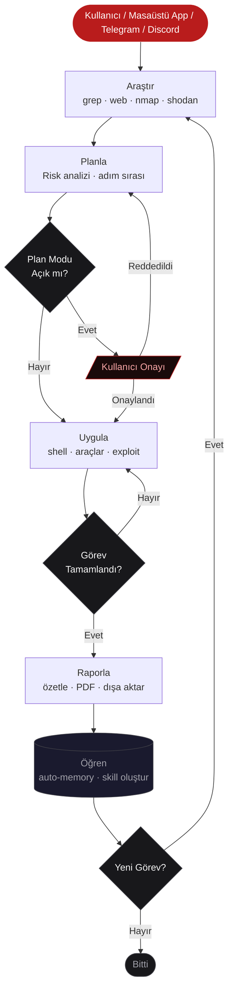

<div align="center">

```
 ███████╗███████╗████████╗██╗██╗  ██╗
 ██╔════╝██╔════╝╚══██╔══╝██║██║  ██║
 █████╗  █████╗     ██║   ██║███████║
 ██╔══╝  ██╔══╝     ██║   ██║██╔══██║
 ██║     ███████╗   ██║   ██║██║  ██║
 ╚═╝     ╚══════╝   ╚═╝   ╚═╝╚═╝  ╚═╝
```

### ⚔️ Terminalde **ve** Windows masaüstünde çalışan otonom siber güvenlik yapay zeka ajanı

**CTF · Pentest · OSINT · Red Team** — 20+ AI sağlayıcı · 912+ skill · Gateway · MCP · Docker · Kalıcı bellek

<br/>


<br/><br/>


<br/><br/>

### 📥 [**İndir & Kur**](#-kurulum) &nbsp;·&nbsp; 🖥️ [**Windows Masaüstü**](#️-fetih-masaüstü-windows) &nbsp;·&nbsp; 🚩 [**CTF & Pentest**](#-ctf--pentest-kullanımı) &nbsp;·&nbsp; 🤖 [**AI Sağlayıcıları**](#-ai-sağlayıcıları) &nbsp;·&nbsp; 🧩 [**Skill Sistemi**](#-skill-sistemi) &nbsp;·&nbsp; 🌐 [**Gateway**](#-gateway)

</div>

---

## FETIH Nedir?

FETIH, hem terminalde hem de **modern bir Windows masaüstü uygulamasında** çalışan, Türkçe/İngilizce destekli bir siber güvenlik yapay zeka ajanıdır. Kod yazar, test çalıştırır, CTF challenge'ları çözer, pentest akışları yürütür ve raporlar üretir. İstediğin 20'den fazla AI sağlayıcısına bağlanır — ne pahalı bir API'ye kilitlisin, ne de tek bir modele.

Temel fark: FETIH **öğrenir ve kendini geliştirir**. Karmaşık görevleri tamamlayınca otomatik skill oluşturur, bu skill'leri sonraki kullanımda iyileştirir, konuşmalarında önemli bilgileri hatırlar. Telegram'dan mesaj at, cloud VM'de çalışsın — dizüstüne bağlı kalmana gerek yok.

**Temel döngü:** `Araştır → Planla → Uygula → Raporla → Öğren`


```mermaid
flowchart TD
    A([Kullanıcı / Masaüstü App / Telegram / Discord]) --> B[Araştır\ngrep · web · nmap · shodan]
    B --> C[Planla\nRisk analizi · adım sırası]
    C --> D{Plan Modu\nAçık mı?}
    D -- Evet --> E[/Kullanıcı Onayı/]
    D -- Hayır --> F
    E -- Onaylandı --> F[Uygula\nshell · araçlar · exploit]
    E -- Reddedildi --> C
    F --> G{Görev\nTamamlandı?}
    G -- Hayır --> F
    G -- Evet --> H[Raporla\nözetle · PDF · dışa aktar]
    H --> I[(Öğren\nauto-memory · skill oluştur)]
    I --> J{Yeni Görev?}
    J -- Evet --> B
    J -- Hayır --> K([Bitti])

    style A fill:#b91c1c,color:#fff,stroke:none
    style I fill:#1a1a2e,color:#a1a1aa,stroke:#3f3f46
    style K fill:#18181b,color:#a1a1aa,stroke:#3f3f46
    style D fill:#18181b,color:#fafafa,stroke:#3f3f46
    style G fill:#18181b,color:#fafafa,stroke:#3f3f46
    style J fill:#18181b,color:#fafafa,stroke:#3f3f46
    style E fill:#1a0a0a,color:#fca5a5,stroke:#b91c1c
```

---

## 🖥️ FETİH Masaüstü (Windows)

> **YENİ:** FETİH artık sadece bir terminal aracı değil — **WinUI 3 · .NET 10** ile geliştirilmiş, tamamen native bir Windows masaüstü uygulamasına sahip. Terminale hiç dokunmadan, çift tıkla aç, sohbet et, tara.

<div align="center">

| 🎯 Bileşen | Ne Sunar? |
|---|---|
| 🪄 **Akıllı Kurulum Sihirbazı** | Ortalanmış, nokta göstergeli modern akış. Otomatik Python tespiti; sağlayıcı türüne göre **dinamik form** — API anahtarı, tarayıcı/OAuth girişi (Gemini CLI · Codex) ya da yerel **Ollama** yoklaması. |
| 💬 **Canlı Sohbet** | Akıcı token-token yanıt, araç çalıştırma kartları (🔧 çalışıyor → tamamlandı), modern sağ/sol hizalı balonlar, `Ctrl+Enter` ile gönder. |
| 🚩 **Bulgular (Findings) Paneli** | Gerçek zamanlı güvenlik taraması + ajanın yakaladığı **CTF bayraklarını** (`fetih{...}`, `CTF{...}`) otomatik algılayıp listeleyen canlı panel. |
| 🧩 **Yetenekler (Skills)** | **912+** güvenlik becerisini görsel arayüzden ara, filtrele, çalıştır. |
| 🔌 **Masaüstü Köprüsü** | Python çalışma zamanı ile WinUI kabuğu arasında yerel, çift yönlü **WebSocket / NDJSON JSON-RPC** mimarisi — hızlı ve güvenli (loopback + token). |
| ⚙️ **Detaylı Ayarlar** | Sade sayfalar (günlük kullanım) + tüm ham anahtarların olduğu **Detaylı Mod**. Model/sağlayıcı seçimi, kabuk (Git Bash / WSL), izinler, sandbox — hepsi arayüzden. |

</div>

### 🚀 Hızlı Masaüstü Kurulumu

```powershell
# 1) Tek tıkla kurulum paketi (önerilen):
#    packaging/windows/build-installer.ps1 ile üretilen
#    Fetih-Setup-win-x64.exe dosyasına çift tıkla — gerisini installer halleder.

# 2) Taşınabilir (portable) — kurulum yok, doğrudan çalıştır:
dist\win-x64\Fetih.Desktop.exe

# 3) Komut satırından (geliştirici):
dotnet run --project apps\windows\Fetih.Desktop
```

> 💡 Installer, `fetih.cmd` launcher'ı ve `PYTHONPATH` ortamını **otomatik** ayarlar — elle PATH uğraşı yok.

---

## Neden FETIH?

| | **FETIH** | ChatGPT | Claude Code | Cursor | diğer CLI |
|---|---|---|---|---|---|
| AI Sağlayıcı sayısı | **20+** | 1 | 1 | çoklu | 1–5 |
| Terminal / CLI | ✓ | ✓ | ✓ | kısmi | ✓ |
| **Native Windows masaüstü (GUI)** | **✓ WinUI 3** | ✗ | ✗ | ✗ | ✗ |
| Gerçek shell erişimi | ✓ | kısmi | ✓ | kısmi | bazıları |
| CTF araç seti | **✓ (MCP köprüsü)** | ✗ | ✗ | ✗ | ✗ |
| Pentest araç entegrasyonu | ✓ | ✗ | ✗ | ✗ | ✗ |
| Telegram / Discord gateway | ✓ | ✗ | ✗ | ✗ | ✗ |
| 912+ skill kataloğu | ✓ | ✗ | ✗ | ✗ | ✗ |
| Kalıcı bellek + öğrenme | ✓ | kısmi | kısmi | ✗ | bazıları |
| Multi-agent (paralel) | ✓ | ✗ | kısmi | kısmi | bazıları |
| Offline / yerel model | ✓ | ✗ | ✗ | ✗ | bazıları |
| Docker ile çalıştırma | ✓ | ✗ | ✗ | ✗ | ✗ |
| Açık kaynak | ✓ | ✗ | ✗ | ✗ | çeşitli |

---

## 🚩 CTF & Pentest Kullanımı

FETIH'i CTF ve penetrasyon testlerinde kullanmak için özel bir kurulum gerekmez — sadece ilgili profili etkinleştir ve hedefe yönelt.

### Hızlı Başlangıç: CTF

```bash
# 1. FETIH'i başlat (herhangi bir AI sağlayıcısıyla)
fetih --model claude-sonnet-4-6        # Kod analizi için önerilir
fetih --model gpt-4o                   # Vision gerektiren challenge'lar için
fetih --model gemini-2.5-pro           # 2M token bağlamla devasa dump dosyaları için
fetih --model deepseek/deepseek-r1     # Ücretsiz, thinking modeli — crypto matematiği için

# 2. CTF profilini etkinleştir
fetih config set profile ctf

# 3. Challenge klasörüne gir ve FETIH'e ver
cd /home/ctf/challenge-2025/
fetih -p "bu klasördeki tüm challenge'ları çöz, flag'leri flags.txt'e yaz"
```

### Hızlı Başlangıç: Pentest

```bash
# Pentest profili — nmap, sqlmap, nuclei, ffuf, gobuster, hydra hepsini tanır
fetih config set profile pentest

# Hedef tara (SADECE YETKİLİ SİSTEMLERDE)
fetih -p "hedef.local adresini tara: subdomain, port, web zafiyet, SSL sertifika"
```

---

### CTF Kategorileri ve Yaklaşımlar

FETIH'e herhangi bir challenge dosyası verdiğinde hangi araçları, hangi sırada kullanacağını ve başarısız olursa nasıl geri döneceğini kendisi belirler.

<details>
<summary><b>🔐 Kriptografi</b></summary>

```
sen: "bu string'i çöz: aGVsbG8gd29ybGQ="
FETIH: Base64 decode → "hello world"

sen: "enc.txt → recursive decode et"
FETIH: Hex → Base64 → ROT13 → Caesar(13) → XOR(0x41) → flag{}

sen: "n=..., e=65537, c=... — RSA çöz"
FETIH: factordb lookup → Fermat factorization → Wiener attack → flag

sen: "Bu AES-CBC ciphertext'te padding oracle açığı var mı?"
FETIH: Padding oracle Python template üretir → saldırı kodu çalıştırır
```
</details>

<details>
<summary><b>🖼️ Steganografi</b></summary>

```
sen: "challenge.png'de gizlenmiş flag var"
FETIH: LSB analiz (R/G/B/A kanalları) → alpha channel → görsel fark → flag

sen: "audio.wav'i incele"
FETIH: DTMF tone decode → WAV LSB → Morse analiz → spektogram (vision ile) → flag
```
</details>

<details>
<summary><b>⚙️ Binary / Reverse Engineering</b></summary>

```
sen: "./binary'yi analiz et"
FETIH: file + strings + objdump + readelf → NX/PIE/canary tespiti → zafiyet

sen: "buffer overflow var, exploit yaz"
FETIH: cyclic pattern → offset hesapla → ROP gadget ara → shellcode üret → exploit

sen: "challenge.tld:1337'ye bağlan"
FETIH: pwntools remote() wrapper → socket → exploit zinciri çalıştırır
```
</details>

<details>
<summary><b>🌐 Web</b></summary>

```
sen: "login.php'yi test et"
FETIH: SQLi (error-based, blind) → XSS → LFI → IDOR → dizin keşfi → payload önerileri

sen: "JWT token'ı kır: eyJ..."
FETIH: Decode → alg:none saldırı → HMAC brute-force → claim forge → admin token
```
</details>

<details>
<summary><b>🔎 Forensics / OSINT</b></summary>

```
sen: "memory.dmp'den flag çıkar"
FETIH: strings sweep → volatility3 → cmdline geçmişi → flag

sen: "bu PCAP'te ne var?"
FETIH: Binary parser → HTTP/FTP/DNS stream → cleartext credential → flag

sen: "hedef.com hakkında OSINT topla"
FETIH: whois → DNS TXT/MX/NS → Shodan → cert.sh → LinkedIn/GitHub → rapor
```
</details>

---

### 💥 Vitrin: Toplu & Paralel Çözüm

**Tek komutla çok sayıda challenge** — sırayla ya da her kategori ayrı terminalde paralel:

```bash
# Tek komut, sıralı çözüm:
fetih --auto -p "/home/ctf/final/ klasöründeki tüm challenge'ları çöz,
                 flag{...} formatındaki string'leri ./flags.txt'e yaz,
                 hangi araçları kullandığını açıkla."

# Ya da paralel — her kategori kendi terminalinde, farklı model:
cd /ctf/crypto    && fetih --auto -p "tüm challenge'ları çöz, flag'leri kaydet"   # ucuz düşünen model
cd /ctf/pwn       && fetih --auto -p "binary'leri analiz et, exploitleri yaz"     # kod odaklı model
cd /ctf/forensics && fetih --auto -p ".pcap, .dmp, .raw dosyalarını incele"
```

FETIH'in tipik çıktısı:
```
[chal1.png]  → LSB R kanalı → flag{lsb_hidden_r}
[audio.wav]  → DTMF Goertzel decode → 0258# → flag{dtmf_0258}
[token.jwt]  → HMAC brute → "secret" → admin forge → flag{admin_jwt}
[pwn1]       → checksec → cyclic → offset=72 → shellcode → flag{ret2win}
[enc.txt]    → 3 katman: Hex→Base64→ROT47 → flag{multi_encoded}
[photo.jpg]  → derin EXIF → COM marker → flag{hidden_in_metadata}
```

---

### 📄 Vitrin: Pentest Raporu

```bash
fetih
> /tools pentest
> "hedef.com'u kapsamlı tara: subdomain keşfi, açık portlar,
>  web zafiyetleri, SSL/TLS sorunları — önem sırasına göre raporla"

# FETIH sırayla: subfinder/amass → nmap → nuclei → nikto → testssl.sh
# Tüm bulguları birleştirir, CVSS skorlar, markdown rapor üretir.

> /export pdf    # PDF raporu oluştur
```

---

## 🤖 AI Sağlayıcıları

FETIH 20'den fazla AI sağlayıcısına bağlanır. Hepsini `fetih model` komutuyla ya da masaüstü uygulamasının **Model & Sağlayıcı** sayfasından değiştirebilirsin. Kod değişikliği yok, lock-in yok.

```bash
# Başlatırken sağlayıcı belirt:
fetih --model claude-sonnet-4-6
fetih --model gemini/gemini-2.5-pro
fetih --model ollama/qwen2.5-coder:32b          # Yerel, ücretsiz, offline

# Çalışırken değiştir:
fetih model

# Tarayıcı / OAuth ile giriş (API anahtarı gerekmez):
fetih auth add google-gemini-cli                 # Google Gemini hesabınla
fetih auth add openai-codex                       # ChatGPT / Codex hesabınla
```

> 🔑 **Yeni:** Gemini CLI ve OpenAI Codex/ChatGPT için artık API anahtarı yapıştırmana gerek yok — masaüstü kurulum sihirbazı (ya da `fetih auth add`) **tarayıcı/cihaz kodu OAuth** akışını başlatır, hesabınla tek tıkla giriş yaparsın.

### Sağlayıcı Tablosu

| Sağlayıcı | Env / Giriş | Özellik | CTF/Pentest için |
|-----------|-------------|---------|-----------------|
| **Anthropic (Claude)** | `ANTHROPIC_API_KEY` | Güçlü kod analizi, vision | ✓ Kod/RE/exploit |
| **OpenAI (GPT-4o)** | `OPENAI_API_KEY` | Güçlü vision, genel | ✓ Stego/görsel |
| **OpenAI Codex / ChatGPT** | 🔑 OAuth (tarayıcı) | Hesapla giriş | ✓ Genel |
| **Google Gemini** | `GEMINI_API_KEY` | 2M token bağlam | ✓ Büyük dump dosyaları |
| **Google Gemini CLI** | 🔑 OAuth (tarayıcı) | Hesapla giriş | ✓ Genel |
| **Groq** | `GROQ_API_KEY` | En hızlı çıkarım (~900 tok/s) | ✓ Hızlı iterasyon |
| **DeepSeek** | `DEEPSEEK_API_KEY` | Thinking mode, ucuz | ✓ Crypto/matematik |
| **OpenRouter** | `OPENROUTER_API_KEY` | 200+ model tek API | ✓ Farklı model dene |
| **Mistral** | `MISTRAL_API_KEY` | Avrupa gizliliği | ✓ Veri gizliliği |
| **xAI (Grok)** | `XAI_API_KEY` | Gerçek zamanlı web | ✓ OSINT/web lookup |
| **Ollama** | — (yerel) | Ücretsiz, offline, gizli | ✓ Hassas hedefler |
| **LM Studio** | — (yerel) | GUI ile yerel model | ✓ Air-gap ortam |
| **Together / Fireworks** | ilgili API key | Açık ağırlıklı, hızlı | ✓ Llama/Mistral |
| **Perplexity** | `PERPLEXITY_API_KEY` | Web aramalı yanıt | ✓ OSINT |
| **Azure / Vertex / Bedrock** | bulut kimlik | Kurumsal | ✓ Kurum pentesti |
| **NVIDIA NIM · HuggingFace · Kimi** | ilgili API key | Nemotron / hub / uzun bağlam | ✓ |

**CTF önerisi:** Ücretsiz başlamak için Ollama (yerel) + `qwen2.5-coder:32b`; ağır analiz için `claude-sonnet-4-6` veya `gemini-2.5-pro`.

```bash
# Ücretsiz yerel model kurulumu (Ollama):
curl -fsSL https://ollama.com/install.sh | sh
ollama pull qwen2.5-coder:32b          # 20GB — güçlü kod modeli
fetih --model ollama/qwen2.5-coder:32b
```

> 💡 Masaüstü kurulum sihirbazında **Ollama** seçersen, FETİH bilgisayarındaki yerel modelleri otomatik tespit edip listeler — API anahtarı sormaz.

---

## 🧰 CTF / Pentest Araç Deposu

FETIH, **83 araç** ve **9 kategori** ile kurulu gelir. İlk kurulumda otomatik sorar; sonradan tek komutla:

```bash
fetih download-tools            # interaktif menü
fetih download-tools all        # hepsini kur
fetih download-tools basic      # temel set (nmap, sqlmap, pwntools, gdb, binwalk...)
fetih download-tools status     # hangisi kurulu göster
```

| Kategori | Örnek Araçlar |
|----------|---------|
| **Ağ Keşif** (15) | nmap, masscan, rustscan, tshark, subfinder, amass, gau |
| **Web Saldırı** (16) | sqlmap, nikto, nuclei, dalfox, ffuf, gobuster, wpscan, httpx |
| **Sızma Testi** (6) | hydra, john, hashcat, netexec, metasploit |
| **Binary/Exploit** (11) | gdb, pwntools, radare2, ropper, checksec, angr, z3, ghidra |
| **Kriptografi** (5) | pycryptodome, gmpy2, sympy, fpylll, padding-oracle |
| **Disk Forensics** (15) | binwalk, foremost, sleuthkit, exiftool, volatility3, pypykatz |
| **Steganografi** (9) | steghide, zsteg, stegseek, ffmpeg, sox, sonic-visualiser |
| **Mobil** (4) | androguard, frida-tools, objection |
| **OSINT** (2) | maigret, sherlock |

---

## 📦 Kurulum

### 🖥️ Windows — Native Masaüstü (en kolay)

Yukarıdaki [**FETİH Masaüstü**](#️-fetih-masaüstü-windows) bölümüne bak: `Fetih-Setup-win-x64.exe` ile çift tıkla kur, ya da portable `.exe`'yi doğrudan çalıştır. Kurulum sihirbazı Python, sağlayıcı ve modeli senin için ayarlar.

### 🐧 Linux / macOS / WSL2 (terminal)

```bash
curl -fsSL https://raw.githubusercontent.com/MustafaKemal0146/fetih/main/scripts/install.sh | bash
source ~/.bashrc   # veya source ~/.zshrc
fetih              # başlat
```

### 🪟 Windows — Terminal (PowerShell)

```powershell
irm https://raw.githubusercontent.com/MustafaKemal0146/fetih/main/scripts/install.ps1 | iex
```

<details>
<summary><b>🛠️ Sorun Giderme — <code>fetih</code> komutu tanınmıyor</b></summary>

Native installer ve `fetih.cmd` launcher'ı PATH'i otomatik ayarlar. Yine de manuel/geliştirici kurulumunda komut bulunamazsa Scripts klasörünü PATH'e ekle:

```powershell
$scriptsPath = py -c "import sysconfig; print(sysconfig.get_path('scripts'))"
[Environment]::SetEnvironmentVariable("PATH", "$env:PATH;$scriptsPath", "User")
# Terminali kapat/aç, sonra: fetih --version
```
</details>

### 🐳 Docker

```bash
docker run -it --rm \
  -e ANTHROPIC_API_KEY=sk-ant-... \
  -v "$HOME/.fetih:/opt/data" \
  --network host \
  ghcr.io/mustafakemal0146/fetih
```

### 👷 Geliştirici Kurulumu (uv)

```bash
git clone https://github.com/MustafaKemal0146/fetih.git
cd fetih
uv sync --extra all
source .venv/bin/activate   # Windows: .venv\Scripts\activate
fetih --version
```

### 📱 Termux (Android)

```bash
pkg install python nodejs-lts ripgrep
pip install fetih-agent[termux-all]
fetih
```

---

## 🧩 Skill Sistemi

FETIH'in en güçlü özelliklerinden biri **skill** sistemidir. Bir skill, tekrar eden görevleri tek komutla çalıştırmanı sağlayan yapılandırılmış bir iş akışıdır. Kataloğunda **912+** hazır skill bulunur; kendi skill'lerini de yazabilirsin. Masaüstü uygulamasının **Yetenekler** sayfasından görsel olarak ara ve çalıştır.

> **Entegre:** [ljagiello/ctf-skills](https://github.com/ljagiello/ctf-skills) (107 referans dosya) ve [Eyadkelleh/awesome-claude-skills-security](https://github.com/Eyadkelleh/awesome-claude-skills-security) (SecLists + LLM testing + agent/command seti).

```bash
fetih skills                       # yüklü skill'leri listele
fetih /skill pentest-web hedef.com
fetih /skill ctf-crypto enc.txt
fetih /skill osint-domain hedef.com
```

| Skill | Ne Yapar? |
|-------|-----------|
| `pentest-web` | Tam web pentest: SQLi, XSS, LFI, IDOR, auth bypass |
| `pentest-network` | Ağ tarama + servis tespiti + zafiyet analizi |
| `ctf-crypto` | Encoding katmanlarını çözer |
| `ctf-forensics` | PCAP, dump, image'dan flag çıkarır |
| `osint-domain` | whois, DNS, cert, subdomain, wayback |
| `bug-bounty` | Kapsamlı bug bounty tarama akışı |
| `code-audit` | Güvenlik açısından kaynak kod denetimi |
| `report-generate` | Bulguları profesyonel rapora dönüştürür |

<details>
<summary><b>✍️ Kendi Skill'ini Yaz</b></summary>

`~/.fetih/skills/ctf-pwn-auto/SKILL.md`:

```markdown
---
name: ctf-pwn-auto
description: Binary verildiğinde checksec + exploit zinciri otomatik çalıştır
tools: [bash, file_read]
---

Verilen binary dosyasını analiz et: {{params}}
1. checksec ile güvenlik bayrakları (NX, PIE, canary, RELRO)
2. strings + objdump/readelf ile fonksiyon listesi
3. Buffer overflow varsa cyclic pattern ile offset
4. Exploit zinciri oluştur (ret2win, ret2libc, ROP) ve çalıştır
```

```bash
fetih /skill ctf-pwn-auto ./pwn_challenge
```
</details>

---

## 🌐 Gateway

FETIH, terminal ve masaüstü dışında **gateway** modu ile Telegram, Discord ve diğer platformlardan da kullanılabilir. Bir kez çalıştır, her yerden eriş.

```bash
fetih gateway setup       # Tüm platformları tek sihirbazla yapılandır
fetih gateway start       # Arka planda başlat
fetih gateway status      # Aktif bağlantıları göster
```

| Platform | Durum | Nasıl? |
|----------|-------|--------|
| **Telegram** | Stabil | `TELEGRAM_BOT_TOKEN` ekle |
| **Discord** | Stabil | `DISCORD_BOT_TOKEN` ekle |
| **Slack** | Stabil | `SLACK_BOT_TOKEN` ekle |
| **WhatsApp** | Beta | Baileys bridge, QR tara |
| **Signal / Matrix** | Beta | signal-cli / homeserver |
| **API (REST)** | Stabil | HTTP endpoint |

```
# Telefondan CTF:
sen → Telegram bot: "pwn1 binary'sini analiz et"
FETIH → checksec → offset → exploit → "flag{buffer_overflow_pwned} (offset: 72)"
# Uzak VM'deyken laptop kapatılabilir — FETIH çalışmaya devam eder.
```

---

## ✨ Öne Çıkan Özellikler

<details>
<summary><b>🧠 Kalıcı Bellek</b></summary>

**Otomatik:** Konuşma sonunda AI önemli bilgileri kaydeder ve sonraki oturumda hatırlar.
```bash
fetih memory add user    "Kali Linux 2025.1, ağ: 10.10.10.0/24"
fetih memory add feedback "Raporları Türkçe yaz"
```
</details>

<details>
<summary><b>🚀 Multi-Agent (Paralel)</b></summary>

```
> "hedef.com'u tara: subdomain, port, web zafiyet — paralel çalıştır"
  [Ajan 1] subfinder → 47 subdomain
  [Ajan 2] nmap SYN → 12 açık port
  [Ajan 3] nuclei → 2 kritik CVE
  Koordinatör birleştirir → tek rapor
```
</details>

<details>
<summary><b>⏰ Hooks & Cron</b></summary>

```bash
fetih cron add cve-watch "0 8 * * *" "dün yayımlanan kritik CVE'leri kontrol et, raporla"
```
</details>

<details>
<summary><b>👁️ Vision (Görsel Analiz)</b></summary>

```
sen: "captcha.png'deki kodu oku"      → bağlı modelin vision'ı → "X9K7AP"
sen: "bu görselde gizli bir şey var mı?" → LSB + metadata + görsel analiz
```
</details>

---

## ⌨️ Komutlar

```bash
fetih                          # İnteraktif mod
fetih -p "görev açıkla"        # Tek seferlik (headless)
fetih --auto -p "görev"        # Onaysız otonom mod
fetih model                    # AI modeli/sağlayıcı değiştir
fetih auth add <sağlayıcı>     # OAuth / kimlik ekle (gemini-cli, openai-codex...)
fetih tools · config · gateway · skills · memory · cron
fetih doctor                   # Ortam sağlık kontrolü
fetih update                   # Sürüm güncelle
```

| İnteraktif Komut | Açıklama |
|-------|----------|
| `/help` · `/model` · `/tools` | Yardım · model · araç profili (`ctf`, `pentest`, `code`, `all`) |
| `/skills` · `/<skill-adı>` | Skill listesi / çalıştır |
| `/memory` · `/checkpoint` · `/compress` | Bellek · kayıt · geçmiş özeti |
| `/export [md\|json\|pdf]` · `/status` | Dışa aktar · durum |
| `Ctrl+C` · `Esc` | İptal · yanıtı durdur |

---

## 🏗️ Mimari

```
fetih/
├── apps/windows/Fetih.Desktop/   # 🖥️ WinUI 3 / .NET 10 modern masaüstü kabuğu
│   ├── Views/                    #    Sohbet, Yetenekler, Bulgular, Ayarlar
│   ├── Setup/                    #    Kurulum sihirbazı (adım/rollback/journal)
│   └── Bridge/                   #    Masaüstü Köprüsü istemcisi (JSON-RPC)
├── fetih_desktop_bridge/         # 🔌 JSON-RPC masaüstü köprü sunucusu (Python)
├── packaging/windows/            # 📦 Inno Setup (.iss), build-installer.ps1, fetih.cmd
├── fetih_cli/                    # CLI giriş noktası, komutlar, auth, config
├── agent/                        # Ajan döngüsü, prompt, multi-agent koordinatör
├── tools/                        # bash · browser · file · web · vision · ctf/ (MCP)
├── gateway/                      # Telegram · Discord · Slack · WhatsApp
├── skills/                       # 912+ skill (security · ctf · osint ...)
└── plugins/                      # Eklenti sistemi
```

---

## 📋 Gereksinimler

- **Python** 3.11+ · **Node.js** 18+ (TUI) · **uv** (installer otomatik kurar)
- Masaüstü uygulaması için: **.NET 10** (installer içerir)
- En az bir AI sağlayıcısı (Ollama ile ücretsiz başlanabilir)
- **CTF/Pentest için:** `nmap`, `sqlmap`, `nuclei`, `ffuf`, `john`, `hashcat`, `binwalk`, `pwntools`

```bash
# Ubuntu/Debian hızlı kurulum:
sudo apt install nmap sqlmap nikto binwalk foremost ffmpeg tesseract-ocr
pip install pwntools
```

---

## 🤝 Katkıda Bulun

```bash
git clone https://github.com/MustafaKemal0146/fetih.git
cd fetih && uv sync --extra all --extra dev && source .venv/bin/activate
pytest tests/ -v
```

---

## 📜 Lisans

**GNU General Public License v3.0 (GPL-3.0)** — Copyright © 2026 Mustafa Kemal Çıngıl

Kaynağı inceleyebilir, değiştirebilir, dağıtabilirsin; değiştirip dağıtırsan/servis olarak sunarsan kaynağı açık paylaşmak zorundasın. Tam metin: [LICENSE](LICENSE)

> ⚠️ **Etik Kullanım:** FETIH yalnızca **yetkili sistemlerde** ve yasal sınırlar içinde kullanılmalıdır. Yetkisiz sistemlere erişim yasadışıdır.

---

<div align="center">

### ⚔️ FETİH — Terminalde ve masaüstünde, yanında.

<a href="https://github.com/MustafaKemal0146/fetih"></a>
<a href="https://github.com/MustafaKemal0146/fetih/issues"></a>
<a href="https://github.com/MustafaKemal0146/fetih/discussions"></a>

</div>
